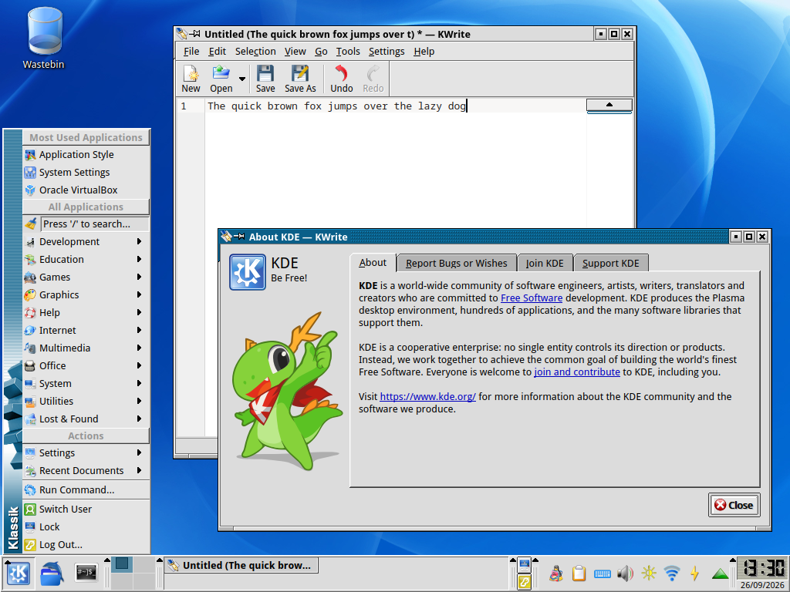

# Klassik
A modern recreation of the classic KDE 3 desktop experience for KDE Plasma 6, built entirely using Qt 6 and Qt Quick, with full support for Wayland and fractional scaling.



## Features
- **Classic panel applets:** Reimplementations of various KDE 3 panel applets, written in C++ and QML, all of which utilize `QStyle` and `QPainter` for drawing, ensuring they look as close to the original KDE 3 applets as possible. Currently included:
  - K Menu (application menu)
  - Quicklaunch
  - Task manager
  - Lock / log out buttons
  - Digital / analog clock
- **Custom panel containment:** KDE 3-style panel containment which uses `QStyle` and `QPainter` to draw the panel background, featuring support for custom background images.
- **Application Style:** Default KDE 2/3 `QStyle` theme, rewritten in Qt 6.
- **Window Decorations:** Ports of old KDE 3 `KWin` themes to `KDecoration3`. Currently included:
  - KDE 2
- **Color Schemes:** Various color schemes included with KDE 3, ported to KDE Plasma.
- **Wallpapers:** a set of wallpapers originally included with KDE 3.

## Requirements
For compilation, the following C++ development libraries are required:
- **Qt 6:** `Core`, `Widgets`, `Qml`, `Quick`
- **KDE Frameworks 6:** `I18n`, `Service`, `KIO`, `ColorScheme`, `Config`, `CoreAddons`, `IconThemes`
- **KDE Plasma 6:** `Plasma`, `PlasmaQuick`, `PlasmaActivities`, `PlasmaActivitiesStats`, `LibKWorkspace`, `KDecoration3`

## Installation

### 1. Download Klassik
Clone the repository:
```bash
git clone https://github.com/neeeeow/Klassik.git
cd Klassik
```
> [!CAUTION]
> By default the `master` branch is cloned. Do not clone the `develop` branch unless you are a developer/contributor; it contains work-in-progress features and may be unstable!

### 2. Compile and install
Compile using `cmake`:
```bash
cmake -B build -DCMAKE_BUILD_TYPE=Release
cmake --build build
sudo cmake --install build
```

### 3. Enable Klassik
Go to **System Settings, Colors & Themes, Global Theme** and select **Klassik**.
> [!IMPORTANT]
> Ensure *Desktop and window layout* is checked before pressing apply to ensure that the Klassik panel gets loaded.

